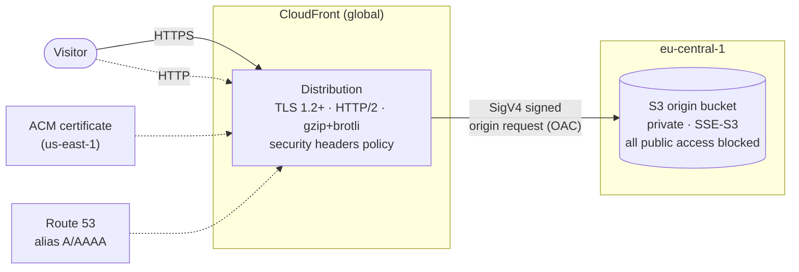
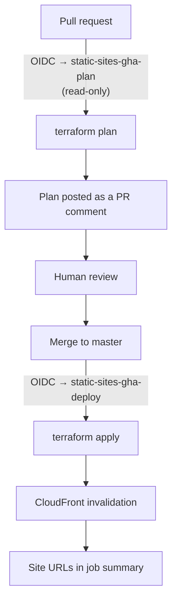

# static-sites

AWS infrastructure and content for two small business websites, managed entirely
as code.

## Architecture



Each site under `sites/` gets its own bucket, distribution, and origin access
control. Adding a third site is a directory plus one entry in the `sites`
variable.

## Delivery pipeline



Both workflows exchange the GitHub-issued OIDC token
for short-lived STS credentials, and the two roles are scoped by
`token.actions.githubusercontent.com:sub`:

| Role                      | Trusted subject                                    | Permissions                                            |
| ------------------------- | -------------------------------------------------- | ------------------------------------------------------ |
| `static-sites-gha-plan`   | `repo:klawik-j/static-sites:pull_request`           | `ReadOnlyAccess` plus the state object                 |
| `static-sites-gha-deploy` | `repo:klawik-j/static-sites:ref:refs/heads/master`  | Only S3 buckets prefixed `static-sites-`, CloudFront, ACM, Route 53 |

## Repository layout

```
.github/workflows/
  plan.yaml           # PR: read-only plan, posted as a comment
  deploy.yaml         # master: apply + CloudFront invalidation
infra/
  bootstrap/          # OIDC provider, IAM roles, remote state bucket (applied by hand)
  versions.tf         # provider + version constraints
  main.tf             # S3 origins, bucket policies, site objects
  cloudfront.tf       # OAC, security headers policy, distributions
  dns.tf              # optional ACM certificates and Route 53 records
sites/
  client-1/           # plain HTML/CSS
  client-2/
```

## Getting started

The bootstrap stack is applied once from a workstation with admin credentials.
Everything after that runs through CI.

```bash
terraform -chdir=infra/bootstrap init
terraform -chdir=infra/bootstrap apply
terraform -chdir=infra/bootstrap output github_repository_variables
```

Copy those four values into the repository's Actions **variables** See
[infra/bootstrap/README.md](infra/bootstrap/README.md) for the details.

Day-to-day deploys need nothing beyond opening a pull request. For running the
main stack locally, see [infra/README.md](infra/README.md).

## Custom domains

Both sites already run on their own domain, each backed by an existing Route 53
hosted zone declared in the `sites` variable:

```hcl
sites = {
  client-1 = {
    domain_names    = ["lewhanna.com", "www.lewhanna.com"]
    route53_zone_id = "Z07911732CKCCC0OA87PL"
  }
  client-2 = {
    domain_names    = ["nasiona-zietarscy.pl", "www.nasiona-zietarscy.pl"]
    route53_zone_id = "Z05544002629RK849CHOL"
  }
}
```

A site with no `domain_names` falls back to its CloudFront domain, which already
serves valid HTTPS. When domains are set, Terraform requests a DNS-validated ACM
certificate in `us-east-1`, writes the validation records, waits for issuance,
and creates the alias records. A variable validation rule rejects a site that
specifies domains without a zone.

## Design decisions

| Decision                                    | Why                                                                                                     |
| ------------------------------------------- | ------------------------------------------------------------------------------------------------------- |
| CloudFront + OAC instead of S3 website hosting | S3 website endpoints are HTTP-only. OAC also keeps the bucket fully private, so no public-access-block exception is needed. |
| OAC rather than the older OAI                | OAI is legacy, does not support SSE-KMS origins, and AWS no longer recommends it for new distributions.  |
| OIDC rather than IAM access keys             | Nothing to store, nothing to rotate, and credentials expire within the hour. Removes the largest standing risk in the account. |
| Separate plan and deploy roles               | A pull request from any branch can read state to produce a plan, but only `master` can mutate anything.  |
| Bootstrap stack with local state             | Breaks the chicken-and-egg problem of needing a state bucket and a role before CI can run. It changes rarely and is the only stack requiring admin rights. |
| S3-native state locking (`use_lockfile`)     | Prevents concurrent applies from corrupting state without paying for or maintaining a DynamoDB table.    |
| `PriceClass_100`                             | Both audiences are in Europe. Wider edge coverage would add cost for no benefit.                        |
| Site files as `aws_s3_object`                | Fine at this size and gives content the same review and rollback path as infrastructure. Would move to `aws s3 sync` if the sites grew. |
| `max-age=0` on HTML, one day on assets       | A deploy is visible immediately while images and CSS still cache at the edge. The pipeline invalidates after every apply anyway. |

## Running cost

| Item                        | Monthly                      |
| --------------------------- | ---------------------------- |
| S3 storage and requests     | well under $0.10 at this size (8.45 MiB across two sites) |
| CloudFront                  | $0 — traffic sits inside the always-free tier (1 TB out, 10M requests) |
| ACM certificates            | $0                           |
| Route 53 hosted zones       | $1.00 (2 zones x $0.50)      |
| Terraform state bucket      | negligible                   |

Roughly a dollar a month for the two custom domains currently configured.

## Not done yet

Tracked deliberately rather than pretended away:

- Reusable `modules/static-site` and separate `dev` / `prod` environments
- `terraform fmt -check`, tflint, and Checkov gates in CI
- GitHub Environment with a required reviewer in front of `apply`
- Bucket versioning, access logging, and lifecycle rules
- Budget alarm and CloudFront error-rate alarms
- Actions pinned to commit SHAs, plus Dependabot
